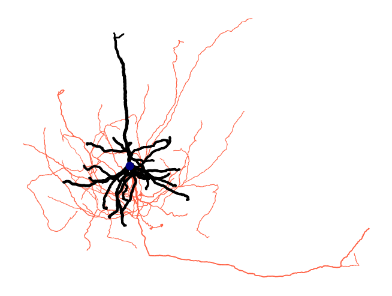

# Getting Started

This tutorial walks through ossify's core features using a real neuron. Every code block is runnable — no CAVE access or special data required.

## Install Ossify

```bash
pip install ossify
```

## Load the Example Cell

This cell is a real neuron from the MICrONS dataset, hosted as an `.osy` file on GitHub.

```python
import ossify as osy

cell = osy.load_cell('https://github.com/ceesem/ossify/raw/refs/heads/main/864691135336055529.osy')
```

## Inspect the Cell

The `describe()` method shows what's inside: layers, annotations, features, and links.

```python
cell.describe()
```

You can also check individual layers:

```python
print("Layers:", cell.layers.names)
print("Annotations:", cell.annotations.names)
print("Skeleton vertices:", cell.skeleton.n_vertices)
print("Graph vertices:", cell.graph.n_vertices)
```

## Explore the Skeleton

The skeleton is a rooted tree — it has a root (at the soma), branch points, and end points.

```python
skel = cell.skeleton

print("Root vertex:", skel.root)
print("Root location:", skel.root_location)
print("Branch points:", skel.n_branch_points)
print("End points:", skel.n_end_points)
print("Cable length:", skel.cable_length(), "nm")
```

Skeleton features are vertex-level metadata stored as arrays:

```python
print("Features:", skel.feature_names)
print("Compartment values:", skel.features['compartment'].unique())
```

## Explore Annotations

Annotations are point clouds with metadata — in this case, synaptic sites.

```python
print("Pre-synaptic sites:", len(cell.annotations.pre_syn))
print("Post-synaptic sites:", len(cell.annotations.post_syn))

# Each annotation has features
print("Pre-syn features:", cell.annotations.pre_syn.feature_names)
```

## Map a Feature Across Layers

The graph layer has a `size_nm3` feature (volume per vertex). Let's aggregate it onto the skeleton using the link between them.

```python
volume = cell.graph.map_features_to_layer("size_nm3", layer='skeleton', agg='sum')
cell.skeleton.add_feature(volume)

print("Volume feature added:", 'size_nm3' in cell.skeleton.feature_names)
```

This works because the graph and skeleton are *linked* — ossify knows which graph vertices correspond to which skeleton vertices. The `agg='sum'` parameter tells it to sum the volumes of all graph vertices that map to each skeleton vertex.

## Apply a Mask

Masks let you filter a cell to a subset of vertices. When layers are linked, the mask propagates — annotations and features update automatically.

```python
# Filter to dendrite only (compartment == 3 in SWC convention)
dendrite_mask = cell.skeleton.features['compartment'] == 3

with cell.skeleton.mask_context(dendrite_mask) as masked_cell:
    print("Dendrite cable length:", masked_cell.skeleton.cable_length(), "nm")
    print("Dendrite pre-synaptic sites:", len(masked_cell.annotations.pre_syn))
    print("Dendrite post-synaptic sites:", len(masked_cell.annotations.post_syn))

# Original cell is unchanged
print("Full cable length:", cell.skeleton.cable_length(), "nm")
```

## Make a Plot

Ossify's plotting functions map features to visual properties like color and line width.

```python
fig = osy.plot.plot_cell_2d(
    cell,
    color='compartment',
    palette={1: 'navy', 2: 'tomato', 3: 'black'},
    linewidth='radius',
    linewidth_norm=(100, 500),
    widths=(0.5, 5),
    root_marker=True,
    units_per_inch=100_000,
)
```



## Save the Cell

Save to a local `.osy` file to avoid re-downloading:

```python
osy.save_cell(cell, '864691135336055529.osy')

# Load it back later
cell = osy.load_cell('864691135336055529.osy')
```

## Next Steps

Now that you've loaded, inspected, mapped, masked, and plotted a real neuron:

- [Core Concepts](concepts.md) — understand the data model behind what you just did
- [Linking and Mapping](linking_and_mapping.md) — go deeper on moving data between representations
- [Algorithms](algorithms_and_analysis.md) — compute Strahler numbers, classify axon/dendrite, and more
- [Visualization](visualization_and_plotting.md) — publication-quality figures with colormaps, scale bars, and multi-view layouts
