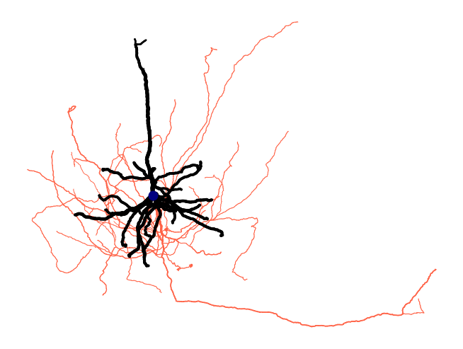

# Ossify

Ossify is a library to work with neuronal morphology, with a focus high resolution synaptic level reconstructions.
Importantly, it aims to solve the challenge of working with objects that have multiple representations, such as meshes and skeletons, decorated with annotations like synapses and allows users to easily convert labels and metadata between them.
In addition, it provides tools to load, manipulate, visualize, and analyze neuron morphologies.

Ossify is built around the concept of a `Cell`, which is a container for multiple `Layer` objects that represent different aspects of the morphology. Surface meshes capture detailed geometry, skeletons provide a rooted tree structure, and point cloud annotations like synapses can decorate different parts of the morphology. It's aim is to be flexible, but with a focus on datasets like [MICrONS](https://www.microns-explorer.org/) or FlyWire that are hosted in [CAVE](https://www.caveconnecto.me/).

## Installation

For right now, ossify must be installed from source locally or from the GitHub repository.

The easiest way would be to add to your pyproject.toml file:

```toml
dependencies = [
    "ossify @ git+https://github.com/ceesem/ossify.git@v0.0.0-pre"
    ...
]
```

## What can it do?

Here's a quick overview of some of the key features and capabilities of Ossify.

```python
# Load a cell from a local file or cloudpath
cell = osy.load_cell('https://github.com/ceesem/ossify/raw/refs/heads/main/864691135336055529.osy')

print("Cable length:", cell.skeleton.cable_length(), "nm")
print("Number of presynaptic sites across cell:", len(cell.annotations.pre_syn))

# Map data from one representation to another:
volume = cell.graph.map_labels_to_layer("size_nm3", layer='skeleton', agg='sum')
cell.skeleton.add_label(volume)

# Apply object-wide filters based on vertex labels
print('\n')
with cell.skeleton.mask_context(cell.skeleton.labels['compartment'] == 3) as masked_cell:
    print("Cable length in dendrite only:", masked_cell.skeleton.cable_length(), "nm")
    print("Number of presynaptic sites in dendrite only:", len(masked_cell.annotations.pre_syn))
    
# Apply algorithmic metrics and attach new data labels
strahler_number = osy.algorithms.strahler_number(cell)
cell.skeleton.add_label(strahler_number, 'strahler_number')
```

You can also map these labels to visualization:

```
# plot the cell with some labels
fig = osy.plot.plot_cell_2d(
    cell,
    color='compartment',
    palette={1: 'navy', 2: 'tomato', 3: 'black'},
    linewidth='radius',
    linewidth_norm=(100, 500),
    widths=(0.5, 5),
    root_marker=True,
    units_per_inch=100_000,
)
```



## Related tools

### CAVEclient

Ossify is designed to work well with [CAVEclient](https://caveconnecto.me/caveclient), a Python library for accessing and interacting with the CAVE database.

### NGLui

NGLui helps map local data analysis to Neuroglancer, a web-based 3d visualization tool for exploring and interacting with large datasets. It's extremely useful for inspecting your analysis in its more complete context.

### Cortical-tools

Cortical-tools is an opinionated extension of CAVEclient that is focused on working with datasets like MICrONs and V1dd.
In particular, it has features for mapping mesh vertices to "level 2" ids that can be useful for incorporating surface meshes into an Ossify Cell.

## Alternative Tools

### Navis

[Navis](https://navis.readthedocs.io/en/latest/) is another Python library for working with neuronal morphology. It focuses on skeleton-based representations and provides tools for analysis and visualization. It has excellent support for transformations, particularly between fly template brain spaces, as well as exports to tools like Blender and Neuron. Ossify complements Navis by providing multi-representation support and advanced data linking capabilities.

### CloudVolume

[CloudVolume](https://github.com/seung-lab/cloud-volume) is a Python library for working with volumetric data, particularly in the context of neuroscience. It provides access to image and segmentation data in cloud formats, and has some tools for working with meshes. Ossify focuses more on the morphological analysis and multi-representation aspects, while CloudVolume is more about data access and handling large volumetric datasets.

### MeshParty

[MeshParty](https://github.com/CAVEconnectome/MeshParty) is a Python library for working with 3d Mesh and skeleton data, and served as a precursor for many of the ideas in Ossify. It has strong support for mesh processing and visualization, as well as some tools for skeleton analysis, but was designed before many of the features we now use in CAVE were developed. Ossify builds on these ideas and adds more advanced data linking, mapping, and analysis capabilities.