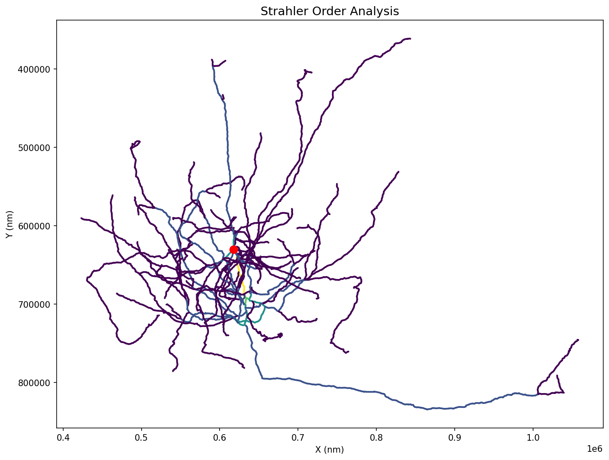
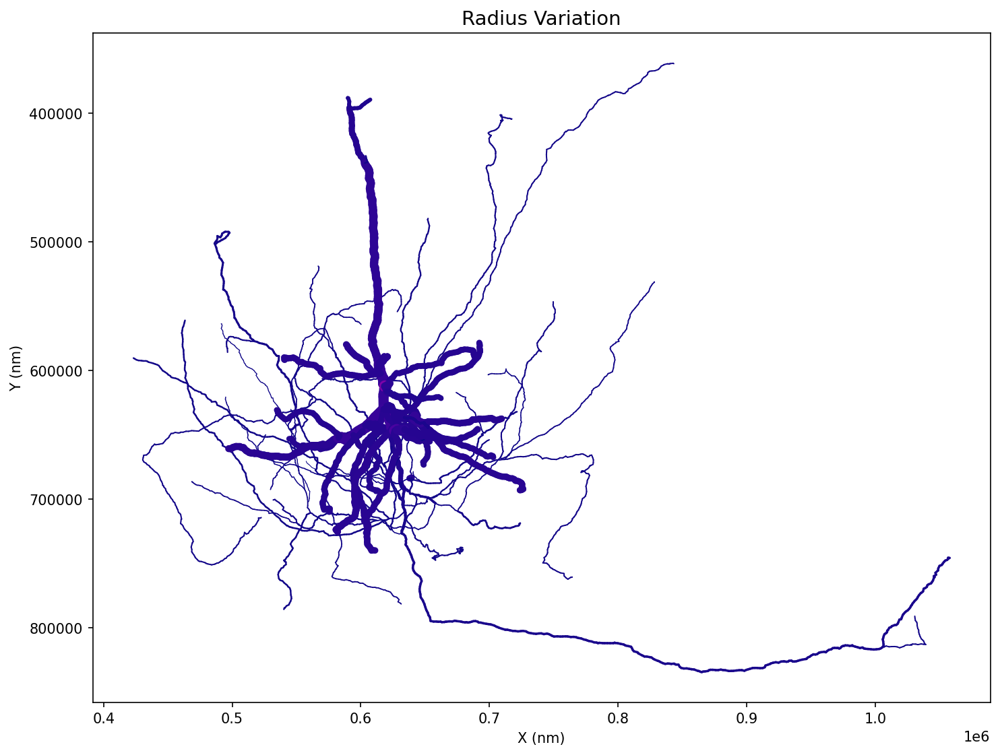
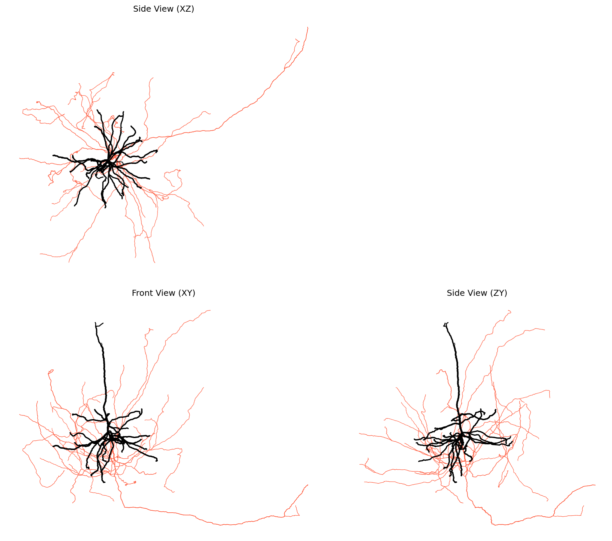
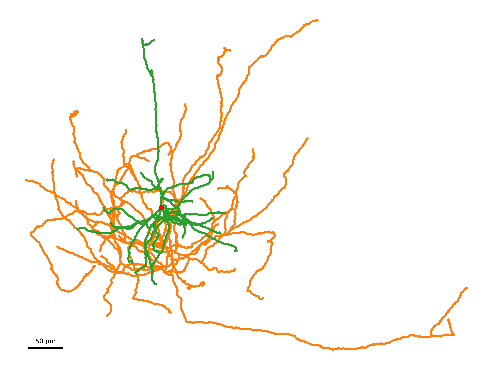
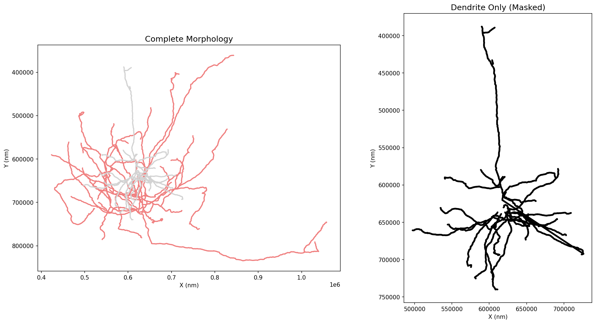

# Visualization and Plotting

!!! warning "AI-Generated Documentation"
    This documentation was generated with assistance from AI. While we strive for accuracy, errors may be present. If you find issues, unclear explanations, or have suggestions for improvement, please [report them on GitHub](https://github.com/ceesem/ossify/issues).

Ossify provides 2D visualization capabilities for morphological data analysis and publication-quality figures. Currently, plotting functions are implemented for skeleton layers, with support for other layer types planned for future releases.

!!! info "Current Plotting Support"
    Visualization functions currently work with **skeleton layers only**. Support for plotting meshes, graphs, and annotations is planned for future releases. The plotting API is designed to be extensible to other layer types.

## Basic Skeleton Plotting

### Simple 2D Projections

```python
import ossify
import matplotlib.pyplot as plt

# Load a real neuron from the example dataset
cell = ossify.load_cell('https://github.com/ceesem/ossify/raw/refs/heads/main/864691135336055529.osy')

# Basic 2D plot
fig, ax = plt.subplots(figsize=(8, 6))
ossify.plot_morphology_2d(cell, projection="xy", ax=ax)
ax.set_title("Basic Skeleton Plot")
plt.show()
```


*Example showing a real neuron with compartment classification: blue (axon), red (dendrite), black (soma).*

### Different Projections

```python
# Plot different 2D projections
projections = ["xy", "xz", "yz"]
fig, axes = plt.subplots(1, 3, figsize=(15, 5))

for i, proj in enumerate(projections):
    ossify.plot_morphology_2d(
        cell, 
        projection=proj, 
        ax=axes[i]
    )
    axes[i].set_title(f"Projection: {proj}")
    axes[i].set_aspect("equal")

plt.tight_layout()
plt.show()
```

## Styling and Customization

### Color-Coded Visualization

```python
# Add algorithmic analysis for visualization
from ossify.algorithms import strahler_number
strahler_vals = strahler_number(cell)
cell.skeleton.add_label(strahler_vals, 'strahler_number')

# Color by Strahler order (branching complexity)
fig, ax = plt.subplots(figsize=(10, 8))
ossify.plot_morphology_2d(
    cell,
    projection="xy",
    color="strahler_number",      # Color by Strahler order
    palette="viridis",            # Colormap
    ax=ax
)
ax.set_title("Strahler Order Analysis")
plt.show()
```



*Strahler order analysis showing branching complexity. Higher orders (yellow) represent main stems, lower orders (purple) represent fine branches.*

```python
# Color by continuous variable (radius)
fig, ax = plt.subplots(figsize=(10, 8))
ossify.plot_morphology_2d(
    cell,
    projection="xy", 
    color="radius",               # Color by radius
    palette="plasma",             # Colormap
    linewidth="radius",           # Width also varies with radius
    linewidth_norm=(100, 500),    # Radius range for normalization
    widths=(0.5, 8),             # Final line width range
    ax=ax
)
ax.set_title("Radius Variation")
plt.show()
```



*Radius variation shown through both color and line width. Thicker, brighter lines indicate larger radii.*

### Line Width and Transparency

```python
# Variable line width based on radius
fig, ax = plt.subplots(figsize=(10, 8))
ossify.plot_morphology_2d(
    cell,
    projection="xy",
    linewidth="radius",           # Width proportional to radius
    widths=(1, 10),              # Min/max line widths
    color="compartment",
    palette={"0": "skyblue", "1": "orange"},
    ax=ax
)
ax.set_title("Variable Line Width")
plt.show()

# Transparency effects
fig, ax = plt.subplots(figsize=(10, 8))
ossify.plot_morphology_2d(
    cell,
    projection="xy",
    alpha=0.7,                   # Semi-transparent
    color="compartment",
    palette={"0": "blue", "1": "red"},
    ax=ax
)
ax.set_title("Semi-Transparent Rendering")
plt.show()
```

### Root Markers

```python
# Highlight the root vertex
fig, ax = plt.subplots(figsize=(10, 8))
ossify.plot_morphology_2d(
    cell,
    projection="xy",
    color="compartment",
    palette={"0": "blue", "1": "red"},
    root_marker=True,            # Show root marker
    root_size=200,               # Root marker size
    root_color="gold",           # Root marker color
    ax=ax
)
ax.set_title("Skeleton with Root Marker")
plt.show()
```

## Multi-View Visualization

### Three-Panel Layouts

```python
# Automatic multi-view figure
axes = ossify.plot_cell_multiview(
    cell,
    layout="three_panel",        # xy, xz, zy views
    color="compartment",
    palette={1: 'navy', 2: 'tomato', 3: 'black'},
    linewidth="radius",
    linewidth_norm=(100, 500),
    widths=(0.5, 3),
    units_per_inch=100_000,      # Scale factor
    despine=True                 # Clean appearance
)

# axes is a dictionary: {"xy": ax1, "xz": ax2, "zy": ax3}
view_titles = {"xy": "Front View (XY)", "xz": "Side View (XZ)", "zy": "Side View (ZY)"}
for proj, ax in axes.items():
    ax.set_title(view_titles[proj])

plt.show()
```



*Three-panel layout showing the same neuron from different angles. This comprehensive view reveals the 3D structure and spatial organization of compartments.*

### Side-by-Side and Stacked Layouts

```python
# Side-by-side layout (xy | zy)
fig, axes = ossify.plot_cell_multiview(
    cell,
    layout="side_by_side",
    color="radius",
    palette="plasma",
    units_per_inch=15
)

# Stacked layout (xz over xy)
fig, axes = ossify.plot_cell_multiview(
    cell,
    layout="stacked", 
    color="compartment",
    palette={"0": "green", "1": "purple"},
    units_per_inch=12
)
```

## Advanced Plotting Features

### Custom Color Palettes

```python
# Discrete color mapping
compartment_colors = {
    0: "#2E86AB",    # Blue for dendrite
    1: "#A23B72",    # Pink for axon
}

fig, ax = plt.subplots(figsize=(10, 8))
ossify.plot_morphology_2d(
    cell,
    color="compartment",
    palette=compartment_colors,
    linewidth="radius",
    widths=(2, 8),
    ax=ax
)

# Continuous colormap with normalization
fig, ax = plt.subplots(figsize=(10, 8))
ossify.plot_morphology_2d(
    cell,
    color="radius",
    palette="coolwarm",
    color_norm=(0.5, 2.5),       # Custom color range
    ax=ax
)
```

### Projection Customization

```python
# Y-axis inversion for image-like coordinates
fig, ax = plt.subplots(figsize=(10, 8))
ossify.plot_morphology_2d(
    cell,
    projection="xy",
    invert_y=True,               # Invert y-axis
    color="compartment",
    palette={"0": "blue", "1": "red"},
    ax=ax
)

# Custom projection function
def custom_projection(vertices):
    """Custom projection: rotate and scale."""
    angle = np.pi / 4  # 45 degrees
    rotation = np.array([
        [np.cos(angle), -np.sin(angle)],
        [np.sin(angle), np.cos(angle)]
    ])
    xy_coords = vertices[:, [0, 1]]  # Extract x, y
    rotated = xy_coords @ rotation.T
    return rotated * 2  # Scale by 2

fig, ax = plt.subplots(figsize=(10, 8))
ossify.plot_morphology_2d(
    cell,
    projection=custom_projection,
    color="radius",
    palette="viridis",
    ax=ax
)
ax.set_title("Custom Projection")
```

### Spatial Offsets

```python
# Plot multiple cells with offsets
cells = [cell]  # In practice, you'd have multiple cells

fig, ax = plt.subplots(figsize=(12, 8))

offsets = [(0, 0), (30, 0), (60, 0)]  # Horizontal spacing
colors = ["blue", "red", "green"]

for i, (cell_to_plot, offset, color) in enumerate(zip(cells * 3, offsets, colors)):
    ossify.plot_morphology_2d(
        cell_to_plot,
        projection="xy",
        offset_h=offset[0],          # Horizontal offset
        offset_v=offset[1],          # Vertical offset
        color=color,
        alpha=0.8,
        ax=ax
    )

ax.set_title("Multiple Cells with Offsets")
ax.set_aspect("equal")
plt.show()
```

## Publication-Quality Figures

### Precise Sizing and Scaling

```python
# Convert to micrometers for better scale
display_cell = cell.transform(lambda x: x / 1000)
display_cell.name = f"{cell.name}_display"

# Create figure with exact physical dimensions
fig, ax = ossify.single_panel_figure(
    data_bounds_min=display_cell.skeleton.bbox[0],    # Data bounds
    data_bounds_max=display_cell.skeleton.bbox[1],
    units_per_inch=50,           # 50 μm per inch
    despine=True,                # Clean appearance
    dpi=300                      # High resolution
)

ossify.plot_morphology_2d(
    display_cell,
    projection="xy",
    color="compartment", 
    palette={1: '#1f77b4', 2: '#ff7f0e', 3: '#2ca02c'},
    linewidth="radius",
    linewidth_norm=(0.1, 0.5),  # Adjusted for μm scale
    widths=(0.5, 4),
    root_marker=True,
    root_color='red',
    ax=ax
)

# Add scale bar
ossify.add_scale_bar(
    ax=ax,
    length=50,                   # 50 μm scale bar
    position=(0.05, 0.05),       # Position as fraction of axes
    color="black",
    linewidth=3,
    label="50 μm",
    fontsize=12
)

plt.savefig("publication_figure.png", dpi=300, bbox_inches="tight")
plt.show()
```



*Publication-quality figure with precise scaling, clean styling, and scale bar. The coordinate system has been converted to micrometers for appropriate scale representation.*

### Multi-Panel Publication Figures

```python
# Create publication-ready multi-panel figure
fig, axes = ossify.multi_panel_figure(
    data_bounds_min=cell.skeleton.bbox[0],
    data_bounds_max=cell.skeleton.bbox[1], 
    units_per_inch=100,
    layout="three_panel",
    gap_inches=0.3,              # Gap between panels
    despine=True,
    dpi=300
)

# Plot same cell in all views with consistent styling
for proj, ax in axes.items():
    ossify.plot_morphology_2d(
        cell,
        projection=proj,
        color="compartment",
        palette={"0": "#1f77b4", "1": "#ff7f0e"},  # Professional colors
        linewidth="radius", 
        widths=(1, 4),
        root_marker=True,
        root_size=100,
        root_color="black",
        ax=ax
    )
    
    # Add scale bar to xy view only
    if proj == "xy":
        ossify.add_scale_bar(
            ax=ax,
            length=5,
            position=(0.8, 0.05), 
            label="5 μm",
            fontsize=10
        )

plt.savefig("multiview_figure.pdf", dpi=300, bbox_inches="tight")
plt.show()
```

## Working with Real Data

### CAVEclient Data Visualization

```python
# Visualize data loaded from CAVEclient
# (Assuming cell loaded with ossify.load_cell_from_client)

if hasattr(cell, 'skeleton') and cell.skeleton is not None:
    # Convert from nanometers to micrometers for display
    display_cell = cell.transform(lambda x: x / 1000)
    display_cell.name = f"{cell.name}_display"
    
    # Plot with appropriate scaling
    fig, ax = ossify.single_panel_figure(
        data_bounds_min=display_cell.skeleton.bbox[0],
        data_bounds_max=display_cell.skeleton.bbox[1],
        units_per_inch=50,  # 50 μm per inch
        despine=True
    )
    
    # Color by compartment if available
    color_by = "compartment" if "compartment" in display_cell.skeleton.label_names else None
    
    ossify.plot_morphology_2d(
        display_cell,
        color=color_by,
        palette={"0": "blue", "1": "red"} if color_by else "black",
        linewidth="radius" if "radius" in display_cell.skeleton.label_names else 2,
        ax=ax
    )
    
    # Add scale bar in micrometers
    ossify.add_scale_bar(
        ax=ax,
        length=50,  # 50 μm
        position=(0.1, 0.1),
        label="50 μm",
        color="black"
    )
```

### Algorithm Results Visualization

```python
# Visualize results of morphological analysis
import ossify

# Compute Strahler numbers
strahler = ossify.strahler_number(cell)
cell.skeleton.add_label(strahler, name="strahler")

# Create figure showing Strahler analysis
fig, axes = plt.subplots(1, 2, figsize=(16, 8))

# Original morphology
ossify.plot_morphology_2d(
    cell,
    projection="xy",
    color="compartment",
    palette={"0": "blue", "1": "red"},
    linewidth="radius",
    widths=(1, 6),
    ax=axes[0]
)
axes[0].set_title("Compartment Classification")

# Strahler analysis
ossify.plot_morphology_2d(
    cell,
    projection="xy", 
    color="strahler",
    palette="viridis",
    linewidth=3,
    ax=axes[1]
)
axes[1].set_title("Strahler Order")

plt.tight_layout()
plt.show()
```

## Integrating with Analysis Workflows

### Before and After Comparison

```python
# Demonstrate masking visualization
fig, axes = plt.subplots(1, 2, figsize=(16, 8))

# Original morphology
ossify.plot_morphology_2d(
    cell,
    projection="xy",
    color='compartment',
    palette={1: 'lightblue', 2: 'lightcoral', 3: 'lightgray'},
    linewidth=2,
    ax=axes[0]
)
axes[0].set_title("Complete Morphology")

# Dendrite only (compartment == 3)
with cell.mask_context('skeleton', cell.skeleton.labels['compartment'] == 3) as masked_cell:
    ossify.plot_morphology_2d(
        masked_cell,
        projection="xy",
        color='black',
        linewidth=3,
        ax=axes[1]
    )
axes[1].set_title("Dendrite Only (Masked)")

for ax in axes:
    ax.set_xlabel("X (nm)")
    ax.set_ylabel("Y (nm)")

plt.tight_layout()
plt.show()
```



*Masking visualization showing the complete morphology (left) and filtered dendrite compartment (right). Masking enables focused analysis on specific cellular regions.*

### Masking Visualization

```python
# Visualize masking results
def plot_masked_comparison(cell, mask, mask_name="Mask"):
    """Show original vs masked data."""
    
    masked_cell = cell.apply_mask("skeleton", mask, as_positional=True)
    
    fig, axes = plt.subplots(1, 2, figsize=(16, 8))
    
    # Original with mask highlighted
    colors = ["lightgray" if not m else "red" for m in mask]
    ossify.plot_morphology_2d(
        cell,
        projection="xy",
        color=colors,
        linewidth=2,
        ax=axes[0]
    )
    axes[0].set_title(f"Original (highlighted: {mask_name})")
    
    # Masked result
    ossify.plot_morphology_2d(
        masked_cell,
        projection="xy",
        color="blue",
        linewidth=3,
        ax=axes[1]
    )
    axes[1].set_title(f"Masked Result")
    
    plt.tight_layout()
    return fig, axes

# Example usage
# quality_mask = cell.skeleton.get_label("quality") > 0.8
# plot_masked_comparison(cell, quality_mask, "High Quality")
```

## Key Plotting Functions

### Core Plotting Functions
- `ossify.plot_morphology_2d(cell, projection="xy", color=None, palette="coolwarm", ...)` - Main 2D plotting function
- `ossify.plot_cell_multiview(cell, layout="three_panel", ...)` - Multi-view layouts

### Figure Creation
- `ossify.single_panel_figure(data_bounds_min, data_bounds_max, units_per_inch, ...)` - Precise single panel
- `ossify.multi_panel_figure(data_bounds_min, data_bounds_max, units_per_inch, layout, ...)` - Multi-panel layouts

### Enhancements
- `ossify.add_scale_bar(ax, length, position=(0.05, 0.05), label=None, ...)` - Add scale bars

### Projection Options
- Standard projections: `"xy"`, `"xz"`, `"yz"`, `"yx"`, `"zx"`, `"zy"`
- Custom projection functions that take vertices and return 2D coordinates

### Styling Parameters
- `color` - Label name, array, or single color
- `palette` - Colormap name or color dictionary
- `linewidth` - Label name, array, or single value
- `alpha` - Transparency (0-1)
- `root_marker` - Show root vertex marker
- `invert_y` - Invert y-axis for projections containing 'y'

!!! tip "Plotting Best Practices"
    - Use `units_per_inch` for consistent scaling across figures
    - Apply coordinate conversions (nm → μm) for appropriate scale bars
    - Use `despine=True` for clean publication figures
    - Set high DPI (300+) for publication-quality output
    - Color by meaningful biological properties (compartment, Strahler order)
    - Add scale bars with appropriate units for the data scale

!!! note "Future Plotting Support"
    The plotting framework is designed to be extensible. Future releases will add support for:
    - Mesh surface rendering
    - Graph network visualization  
    - Annotation scatter plots
    - 3D interactive visualization
    - Animation capabilities